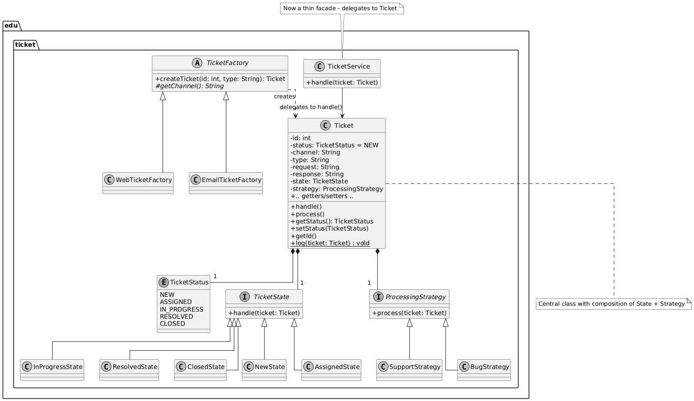

# تمرین شماره ۲ - الگوهای طراحی  

## چکیده
در این تمرین، یک سیستم ساده مدیریت درخواست‌های پشتیبانی (Ticketing System) که به صورت اولیه و procedural پیاده‌سازی شده بود، با استفاده از سه الگوی طراحی اصلی (**State** ، **Strategy** و **Factory**) بازطراحی و بازآرایی شد. هدف اصلی، بهبود کیفیت طراحی از منظر اصول شی‌گرایی (SOLID + PLK + CRP)، افزایش قابلیت نگهداری، توسعه‌پذیری و خوانایی کد بود.

## توصیف سیستم

سیستم مدیریت درخواست‌های پشتیبانی (Ticket) دارای رفتارهای زیر است:

- **دریافت درخواست**: از کانال‌های WEB یا EMAIL وارد می‌شود و ابتدا وضعیت NEW می‌گیرد.
- **پردازش درخواست**: بر اساس نوع درخواست (مثل BUG یا دیگر)، به واحد مربوطه ارجاع داده می‌شود.
- **پاسخ‌دهی**: در طول پردازش، پاسخ مناسب (بسته به نوع) تولید و ارسال می‌شود.
- **وضعیت‌های درخواست**: NEW → ASSIGNED → IN_PROGRESS → RESOLVED → CLOSED
- **ثبت رویداد**: در پایان هر مرحله، لاگ عملیات ثبت می‌شود.

کد اولیه درست کار می‌کرد اما فاقد طراحی شی‌گرا بود و تمام منطق در یک متد بزرگ با if-elseهای متعدد قرار داشت.

### مشکلات و ایرادات اصلی ساختار فعلی
این ساختار (و متد handle در TicketService) مشکلات زیر را دارد:

۱. نقض اصول SOLID

- اصل TicketService :SRP (Single Responsibility) مسئولیت‌های متعدد (تغییر وضعیت، پردازش نوع، پاسخ‌دهی، لاگینگ) را دارد.
- اصل OCP (Open-Closed): برای اضافه کردن وضعیت/نوع/کانال جدید، باید if-elseها را تغییر داد (closed for modification).
- اصل DIP: وابستگی مستقیم به جزئیات Ticket (بدون abstraction).

۲. نقض PLK (Law of Demeter) و CRP

کلاس TicketService مستقیم به فیلدهای داخلی Ticket دسترسی دارد (coupling بالا).
هیچ composition واقعی وجود ندارد – همه چیز متمرکز در یک متد.

۳. مشکلات عملی

- متدهای طولانی و پیچیده: متد handle بیش از حد بزرگ و پر از شرط است.
- دشواری افزایش قابلیت و انجام تست: اضافه کردن ویژگی جدید (مثل وضعیت جدید) ریسک باگ دارد.
- تکرار کد: منطق نوع (BUG vs. other) در چند جا تکرار شده.
- بدون encapsulation: رفتار تیکت خارج از کلاس Ticket است.

۴. نتیجه
این کد "کار می‌کند" اما برای پروژه واقعی نامناسب است. هدف تمرینآن است که بازطراحی با State + Strategy + Factory برای حل این مشکلات.

## بخش ۱ - تشخیص زیرمسائل و الگوهای مناسب

با تحلیل کد اولیه، سه زیرمسئله اصلی شناسایی شد:

### ۱. رفتار وابسته به حالت (State-dependent Behavior)
- **شرح**: رفتار سیستم (پردازش، پاسخ‌دهی، تغییر وضعیت) بسته به وضعیت فعلی تیکت متفاوت است.
- **الگوی پیشنهادی**: State Pattern
- **دلیل**: این الگو رفتار هر وضعیت را در کلاس جداگانه encapsulate می‌کند و امکان افزودن وضعیت جدید بدون تغییر کلاس اصلی را فراهم می‌کند (OCP).
- **کلاس‌های تعریف‌شده**: TicketState (interface) و پیاده‌سازی‌ها: NewState, AssignedState, InProgressState, ResolvedState, ClosedState

### ۲. پردازش متفاوت بر اساس نوع درخواست
- **شرح**: ارجاع و پاسخ‌دهی بسته به نوع تیکت (BUG یا غیر BUG) متفاوت است.
- **الگوی پیشنهادی**: Strategy Pattern
- **دلیل**: الگوریتم‌های پردازش را قابل تعویض و مستقل از کلاس اصلی می‌کند (OCP + SRP).
- **کلاس‌های تعریف‌شده**: ProcessingStrategy (interface) و پیاده‌سازی‌ها: BugStrategy, SupportStrategy

### ۳. ایجاد تیکت وابسته به کانال ورودی
- **شرح**: تنظیمات اولیه و رفتار دریافت بسته به کانال (WEB یا EMAIL) متفاوت است.
- **الگوی پیشنهادی**: Factory Method Pattern
- **دلیل**: ساخت شیء پیچیده را encapsulate کرده و امکان افزودن کانال جدید بدون تغییر کد کلاینت را می‌دهد (OCP).
- **کلاس‌های تعریف‌شده**: TicketFactory (abstract) و پیاده‌سازی‌ها: WebTicketFactory, EmailTicketFactory

## بخش ۲ - Class Diagram ساختار نهایی

(توضیح کوتاه: Ticket از ترکیب State و Strategy استفاده می‌کند. TicketFactory مسئول ساخت تیکت است و TicketService فقط نقش نازک facade دارد.)

## بخش ۳ - اعمال الگوها

کد اولیه بازآرایی شد و الگوها به صورت زیر اعمال گردیدند:

- **State Pattern**: تمام منطق if-else وضعیت‌ها به کلاس‌های State منتقل شد.
- **Strategy Pattern**: منطق ارجاع و پاسخ‌دهی بر اساس نوع به Strategyها منتقل شد.
- **Factory Pattern**: ساخت تیکت از constructor مستقیم به کارخانه‌ها منتقل شد.
- **بهبودهای جانبی**:
  - جایگزینی String وضعیت با enum TicketStatus
  - متمرکز کردن لاگینگ در یک متد استاتیک در Ticket
  - ساده‌سازی TicketService به یک delegate ساده

## بخش ۴ - تحلیل اصول شی‌گرایی (SOLID + PLK + CRP)

پس از اعمال الگوها، سیستم از منظر اصول زیر بهبود چشمگیری یافت:

- **OCP (Open-Closed Principle)**:  
  قبل: برای افزودن وضعیت/نوع/کانال جدید باید if-elseهای TicketService تغییر می‌کرد.  
  بعد: افزودن وضعیت جدید = یک کلاس State جدید؛ افزودن نوع جدید = یک Strategy جدید؛ افزودن کانال جدید = یک Factory جدید. هیچ تغییری در کلاس‌های موجود لازم نیست.

- **SRP (Single Responsibility Principle)**:  
  قبل: TicketService مسئولیت همه چیز (وضعیت، نوع، کانال، لاگینگ) را داشت.  
  بعد: هر کلاس مسئولیت تک دارد (State فقط مدیریت وضعیت، Strategy فقط پردازش نوع، Factory فقط ساخت).

- **PLK (Principle of Least Knowledge)**:  
  قبل: TicketService مستقیم به فیلدهای داخلی Ticket دسترسی داشت.  
  بعد: TicketService فقط متد handle() را صدا می‌زند و از جزئیات داخلی بی‌خبر است.

- **CRP (Composition over Inheritance)**:  
  از ترکیب (composition) برای State و Strategy استفاده شد نه وراثت گسترده، که انعطاف‌پذیری و تست‌پذیری را افزایش داد.

در مجموع، سیستم از یک کد procedural پر از شرط به یک طراحی شی‌گرا، ماژولار و قابل گسترش تبدیل شد.

## روش تحویل

- پروژه در مخزن عمومی GitHub قرار دارد: [لینک مخزن شما]
- تمام کد اصلاح‌شده در مسیر src/main/java/edu/ticket قرار دارد.
- گزارش کامل در همین فایل README.md نوشته شده است.
- نمودار کلاس در پوشه images ذخیره شده است.
- مشارکت هر دو عضو گروه از طریق تاریخچه commitها قابل مشاهده است.

## سپاسگزاری
با آرزوی سلامتی و موفقیت برای استاد گرامی جناب آقای پورسلطانی و دستیاران محترم درس.

