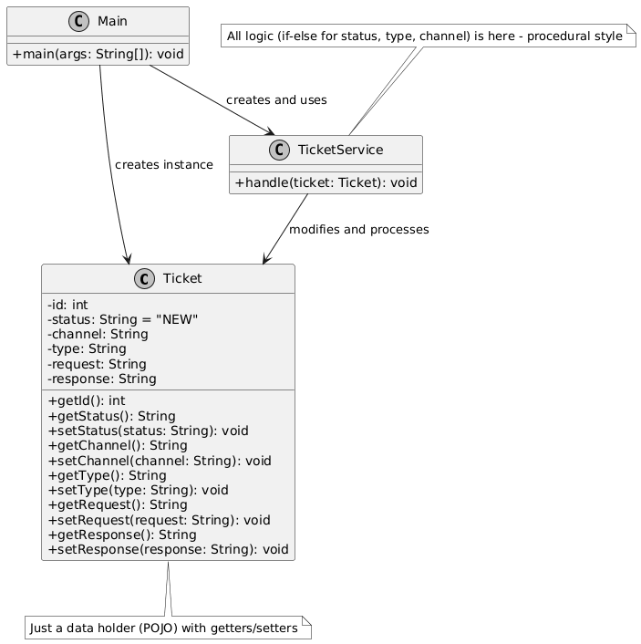

  
# HW02-TicketingService

## ساختار فعلی سیستم 

### توضیح کلی
در کد اولیه ارائه‌شده (Ticket.java, TicketService.java, Main.java)، سیستم به صورت procedural (رویه‌ای) پیاده‌سازی شده است. 
- کلاس **Ticket** فقط یک کلاس داده‌ای (POJO) با فیلدها و getter/setterها است.
- کلاس **TicketService** تمام منطق پردازش (if-else برای وضعیت‌ها، نوع‌ها و کانال‌ها) را در یک متد بزرگ `handle()` مدیریت می‌کند.
- کلاس **Main** فقط برای تست استفاده می‌شود.

این ساختار ساده است اما فاقد اصول شی‌گرایی است و مشکلات زیادی در نگهداری و گسترش دارد.

### دیاگرام ساختار فعلی سیستم با استفاده از UML

### مشکلات و ایرادات اصلی ساختار فعلی
این ساختار (و متد handle در TicketService) مشکلات زیر را دارد:

۱. نقض اصول SOLID

- اصل TicketService :SRP (Single Responsibility) مسئولیت‌های متعدد (تغییر وضعیت، پردازش نوع، پاسخ‌دهی، لاگینگ) را دارد.
- اصل OCP (Open-Closed): برای اضافه کردن وضعیت/نوع/کانال جدید، باید if-elseها را تغییر داد (closed for modification).
- اصل DIP: وابستگی مستقیم به جزئیات Ticket (بدون abstraction).

۲. نقض PLK (Law of Demeter) و CRP

کلاس TicketService مستقیم به فیلدهای داخلی Ticket دسترسی دارد (coupling بالا).
هیچ composition واقعی وجود ندارد – همه چیز متمرکز در یک متد.

۳. مشکلات عملی

- متدهای طولانی و پیچیده: متد handle بیش از حد بزرگ و پر از شرط است.
- دشواری افزایش قابلیت و انجام تست: اضافه کردن ویژگی جدید (مثل وضعیت جدید) ریسک باگ دارد.
- تکرار کد: منطق نوع (BUG vs. other) در چند جا تکرار شده.
- بدون encapsulation: رفتار تیکت خارج از کلاس Ticket است.

۴. نتیجه
این کد "کار می‌کند" اما برای پروژه واقعی نامناسب است. هدف تمرینآن است که بازطراحی با State + Strategy + Factory برای حل این مشکلات.

